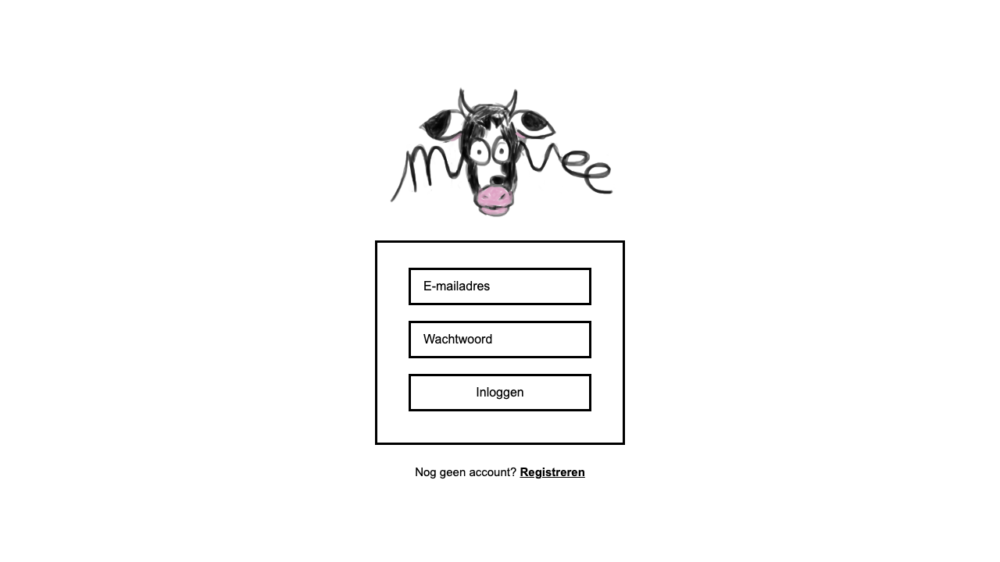

# MooVee

## Inhoudsopgave

- [Inleiding](#inleiding)
- [Screenshot](#screenshot)
- [Gebruikte technieken](#gebruikte-technieken)
- [Installatie en configuratie](#installatie-en-configuratie)
- [Inloggen](#inloggen)
- [npm-commando's](#npm-commando's)
- [Projectmap](#projectmap)
- [NOVI JSON-configuratie](#novi-json-configuratie)

## Inleiding

MooVee is een IMDB-achtig filmplatform. Je kunt films en personen opzoeken, eigen lijsten bijhouden en reviews met scores schrijven.

Belangrijkste functionaliteiten:

1.	Gebruikers kunnen zich inloggen en registreren;
2.	Gebruikers kunnen informatie ophalen over films en acteurs zowel op basis van naam als op basis van TMDB-ID.
3.	Gebruikers kunnen films toevoegen aan een lijst, deze lijst een naam geven en de lijst zo terugvinden. Films die de gebruiker heeft gezien worden automatisch toegevoegd aan een ‘gezien’ lijst.
4.	Gebruikers kunnen een film die ze hebben gezien een score en een review geven en aan ‘favorieten’ toevoegen.

## Screenshot

Loginpagina van MooVee:



## Gebruikte technieken

MooVee is in **JavaScript** met **React**. Voor het bouwen en lokaal draaien gebruik ik **Vite**: dat start de development server en maakt de productiebuild.

Voor navigatie tussen pagina’s gebruik ik **React Router**. De login-staat bewaar ik in **React Context**, zodat elke pagina kan zien of iemand is ingelogd. Het token zelf decodeer ik met **jwt-decode**.

De styling is **CSS met Flexbox**

Voor data gebruik ik twee API’s:

- **NOVI Dynamic API** voor inloggen, registreren, lijsten en reviews
- **TMDB API** voor zoeken van films en personen en details ophalen

## Installatie en configuratie

Voor deze app heb je **Node.js 18+** nodig (met `npm`).

1. Open de projectmap in een terminal.
2. Installeer de dependencies:

```bash
npm install
```

3. Zet het meegeleverde `.env`-bestand in de projectroot (naast `package.json`).  

   Nodig zijn `VITE_NOVI_API_BASE_URL`, `VITE_NOVI_PROJECT_ID`, `VITE_TMDB_API_BASE_URL` en `VITE_TMDB_API_KEY`.

4. Start de app:

```bash
npm run dev
```

5. Open **http://localhost:3000** in je browser.

Voor een productiebuild: `npm run build`, daarna `npm run preview`.

## Inloggen

In de NOVI-config staan al testaccounts:

- **E-mail:** `gast@moovee.nl`
- **Wachtwoord:** `movie123`


Liever een eigen account? Dat kan via de registratiepagina (`/register`).

## npm-commando's

Naast `npm install` zijn dit de belangrijkste scripts:

- `npm run dev` – start de development server (hot reload)
- `npm run build` – maakt een productiebuild in de map `dist/`
- `npm run preview` – toont die build lokaal, zodat je kunt controleren of alles goed werkt

## Projectmap

Kort overzicht van wat waar staat:

- `src/components` – herbruikbare UI-stukken
- `src/pages` – de pagina’s zelf 
- `src/context` – login-state
- `src/hooks` – herbruikbare logica
- `src/services` – alle fetch-calls naar NOVI en TMDB
- `src/assets` – logo en de NOVI API JSON-config

## NOVI JSON-configuratie

Het configuratiebestand voor de NOVI Dynamic API staat hier:

**`src/assets/moovee-init.json`**

Daarin staan de collecties, de testgebruikers en wat startdata.
